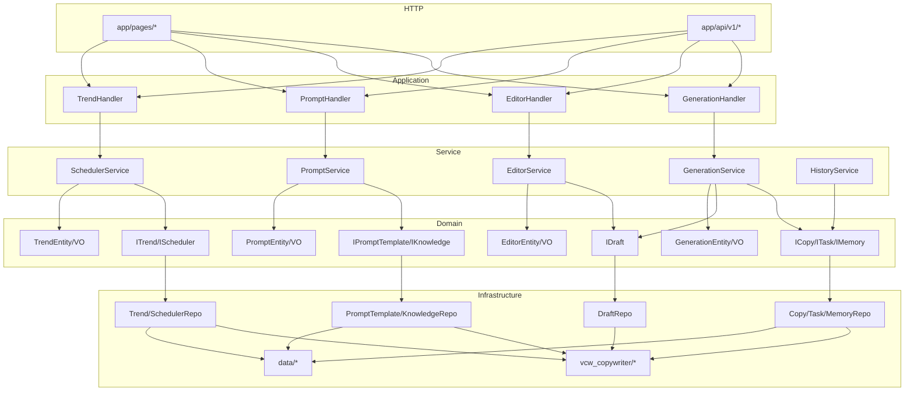

# Infrastructure 层设计文档

## 1. 设计目标

- **隔离数据库与第三方依赖**：所有 ORM、文件系统、Redis、外部 SDK 的调用被限制在 `domains/*/infrastructure/` 中。
- **domain 不依赖 infrastructure**：`domains/*/domain/` 只依赖 Python stdlib，不 import 任何 infrastructure 模块。
- **application 通过 interface 调用 repository**：Service 层（Application 层的一部分）只依赖 `domains/*/domain/repository.py` 中的抽象接口，具体实现由 DI 容器注入。

## 2. Repository Interface 设计

### 2.1 Generation Domain

```python
# domains/generation/domain/repository.py
class ICopyRepository(ABC):
    def save(self, content: str, topic: str, meta: object, output_dir: str) -> str: ...
    def find_recent(self, limit: int, output_dir: str) -> List[Dict]: ...
    def get_stats(self, output_dir: str) -> Dict: ...

class ITaskRepository(ABC):
    def submit(self, task_type: str, worker_fn) -> str: ...
    def get_status(self, task_id: str) -> Optional[Dict]: ...
    def cancel(self, task_id: str) -> bool: ...

class IMemoryRepository(ABC):
    def format_memories(self, topic: str) -> str: ...
```

### 2.2 Editor Domain

```python
# domains/editor/domain/repository.py
class IDraftRepository(ABC):
    def save(self, original_content: str, topic: str,
             source_filepath: str = "", meta: str = "") -> str: ...
    def get(self, draft_id: str) -> Optional[Dict]: ...
    def list_all(self, status: Optional[str] = None) -> List[Dict]: ...
    def update_edited(self, draft_id: str, edited_content: str,
                      edit_note: str) -> bool: ...
    def finalize(self, draft_id: str) -> bool: ...
    def get_diff(self, draft_id: str) -> Tuple[str, str]: ...
    def build_de_ai_prompt(self, content: str) -> str: ...
```

### 2.3 Prompt Domain

```python
# domains/prompt/domain/repository.py
class IPromptTemplateRepository(ABC):
    def save(self, system_prompt: str) -> None: ...
    def load(self) -> str: ...

class IKnowledgeRepository(ABC):
    def get_resources(self) -> Dict: ...
    def format_for_prompt(self, scope: str) -> str: ...
```

### 2.4 Trend Domain

```python
# domains/trend/domain/repository.py
class ITrendRepository(ABC):
    def import_many(self, trends: List[Dict]) -> Tuple[int, int]: ...
    def get_all(self, limit=25, offset=0, time_filter="all",
                sort_by="composite", category_filter="all"
                ) -> Tuple[List[Dict], int]: ...
    def get_fresh(self, limit: int = 5) -> List[Dict]: ...
    def get_by_id(self, trend_id: str) -> Optional[Dict]: ...
    def generate_report(self) -> str: ...
    def delete(self, trend_id: str) -> None: ...
    def delete_expired(self) -> int: ...
    def archive_stale(self) -> int: ...
    def add_manual(self, title: str, summary: str = "",
                   url: str = "", published_at: str = "") -> str: ...
    def select(self, trend_id: str) -> None: ...
    def calc_timeliness(self, trend: Dict) -> int: ...

class ISchedulerRepository(ABC):
    def get_status(self) -> Dict: ...
    def enable(self, interval_minutes: int) -> None: ...
    def disable(self) -> None: ...
    def trigger_now(self) -> Dict: ...
```

## 3. Repository Implementation 设计

| Domain | Implementation | 依赖的基础设施 |
|--------|---------------|-------------|
| generation | `CopyRepository` | `pathlib` (文件系统) |
| generation | `TaskRepository` | `vcw_copywriter.task_queue.TaskQueue` |
| generation | `MemoryRepository` | `vcw_copywriter.memory.MemoryBank` |
| editor | `DraftRepository` | `vcw_copywriter.editor.EditorWorkflow` |
| prompt | `PromptTemplateRepository` | `data/prompts_custom.json` |
| prompt | `KnowledgeRepository` | `vcw_copywriter.knowledge_base` |
| trend | `TrendRepository` | `vcw_copywriter.trend_db.TrendDatabase` |
| trend | `SchedulerRepository` | `vcw_copywriter.scheduler.Scheduler` |

## 4. 依赖关系图

### 4.1 分层依赖（单向）

```
┌─────────────────────────────────────────┐
│  HTTP Layer (app/pages, app/api)        │
│  → imports: application handlers only    │
└─────────────────┬───────────────────────┘
                  │
┌─────────────────▼───────────────────────┐
│  Application Layer                      │
│  - domains/*/application/handlers.py    │
│  - domains/*/application/commands.py    │
│  - domains/*/application/queries.py     │
│  → imports: services + domain models   │
└─────────────────┬───────────────────────┘
                  │
┌─────────────────▼───────────────────────┐
│  Service Layer (services/*.py)          │
│  → imports: domain.repository (ABC)     │
│  → imports: vcw_copywriter (AI logic)   │
└─────────────────┬───────────────────────┘
                  │
┌─────────────────▼───────────────────────┐
│  Domain Layer                           │
│  - domains/*/domain/entity.py           │
│  - domains/*/domain/value_object.py     │
│  - domains/*/domain/service.py          │
│  - domains/*/domain/repository.py       │
│  → imports: NONE (stdlib only)          │
└─────────────────┬───────────────────────┘
                  │
┌─────────────────▼───────────────────────┐
│  Infrastructure Layer                   │
│  - domains/*/infrastructure/repository.py│
│  → imports: domain.repository (ABC impl)│
│  → imports: vcw_copywriter (DB/FS/SDK)  │
└─────────────────────────────────────────┘
```

### 4.2 跨领域依赖



## 5. 关键设计决策

### 5.1 为什么 repository interface 放在 domain 层？

Repository 是领域概念的持久化抽象。将接口放在 `domains/*/domain/repository.py` 确保：
- Domain 层不依赖任何 infrastructure 实现。
- Service 层只依赖抽象，符合依赖倒置原则（DIP）。
- 测试时可以轻松替换为内存中的 fake repository。

### 5.2 为什么 service 层仍然存在？

在当前阶段，service 层承担了两个角色：
1. **Application Service**：用例编排（权限检查、事务管理、DTO 转换）。
2. **Domain Service 代理**：调用纯 domain 逻辑（如 `QualityChecker`、`DiffEngine`）。

未来演进方向：
- 将用例编排逻辑逐步下移到 `application/handlers.py`。
- Service 层退化为更薄的 orchestrator，最终被 handler + repository 替代。
- 但当前保留 service 层可最小化改动，保持测试稳定。

### 5.3 CopyRepository 为什么不依赖 CopywriterGenerator？

`CopywriterGenerator` 是一个混合了 LLM 配置和文件 I/O 的类。将文件保存逻辑提取到 `CopyRepository` 后：
- `CopyRepository` 只负责文件系统操作，不依赖 LLM 配置。
- 测试时无需 mock `CopywriterGenerator`，直接测试文件 I/O。
- 消除了 `CopywriterGenerator` 构造函数对 `api_key` 的强制校验导致的测试失败。

### 5.4 第三方 SDK 的隔离现状

当前通过 repository 隔离了数据库和文件系统，但 LLM SDK（`ModelRouter`、`CopywriterGenerator`）仍然被 Service 层直接调用。

**下一步演进**：引入 `ILLMGateway` 接口，将 LLM 调用也隔离到 infrastructure 层：
```python
# domains/generation/domain/gateway.py
class ILLMGateway(ABC):
    def generate(self, system: str, user: str) -> Tuple[bool, str, str]: ...
    def generate_stream(self, system: str, user: str) -> Iterator[str]: ...
```

## 6. 验证结果

| 检查项 | 结果 |
|--------|------|
| pytest | **42 passed** |
| mypy | **0 errors** (82 source files) |
| bandit | **0 issues** (11,349 LOC) |
| domain → infrastructure 反向依赖 | **0** |

## 7. 文件清单

### 新增/修改的文件

```
domains/generation/domain/repository.py          (NEW)
domains/generation/infrastructure/repository.py  (NEW)
domains/editor/domain/repository.py              (NEW)
domains/editor/infrastructure/repository.py      (NEW)
domains/prompt/domain/repository.py              (NEW)
domains/prompt/infrastructure/repository.py      (NEW)
domains/trend/domain/repository.py               (NEW)
domains/trend/infrastructure/repository.py       (NEW)
services/generation_service.py                   (MODIFIED: use repos)
services/editor_service.py                       (MODIFIED: use draft_repo)
services/prompt_service.py                       (MODIFIED: use template_repo, knowledge_repo)
services/scheduler_service.py                    (MODIFIED: use trend_repo, scheduler_repo)
services/history_service.py                      (MODIFIED: use copy_repo)
app/core/container.py                            (MODIFIED: wire repos)
tests/test_generate.py                           (MODIFIED: mock ModelRouter)
```
